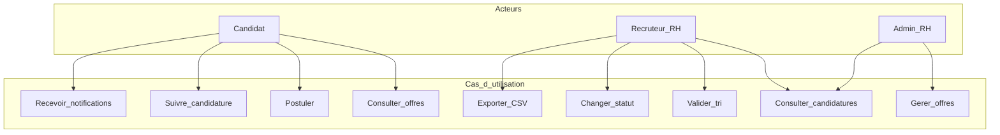
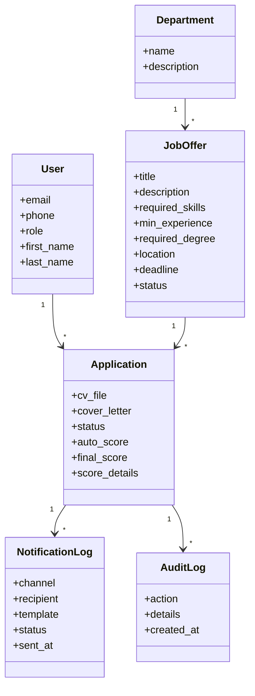
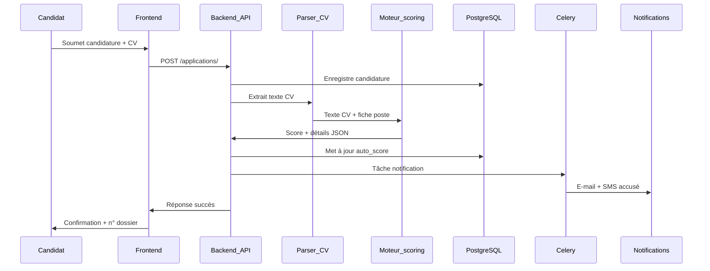
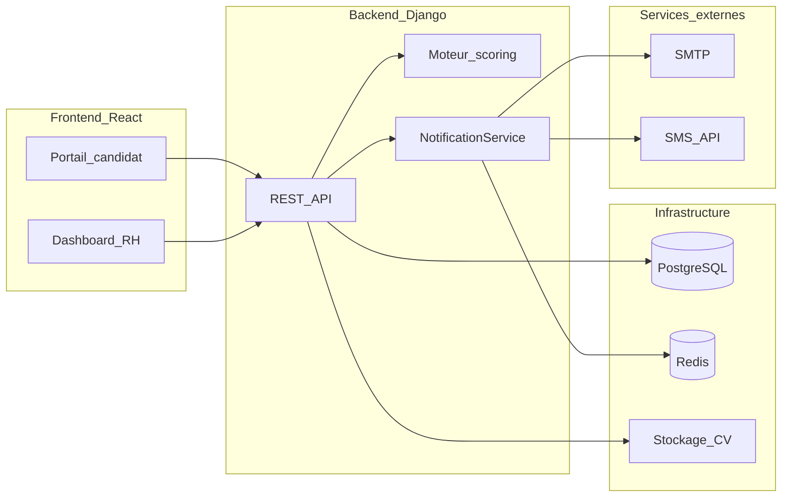

# Architecture SIGER — Maison Galaxy Kinshasa

## Diagramme de cas d'utilisation

```mermaid
flowchart TB
    subgraph actors [Acteurs]
        Candidat
        RecruteurRH[Recruteur_RH]
        AdminRH[Admin_RH]
    end

    subgraph usecases [Cas_d_utilisation]
        UC1[Consulter_offres]
        UC2[Postuler]
        UC3[Suivre_candidature]
        UC4[Gerer_offres]
        UC5[Consulter_candidatures]
        UC6[Valider_tri]
        UC7[Changer_statut]
        UC8[Exporter_CSV]
        UC9[Recevoir_notifications]
    end

    Candidat --> UC1
    Candidat --> UC2
    Candidat --> UC3
    Candidat --> UC9
    RecruteurRH --> UC5
    RecruteurRH --> UC6
    RecruteurRH --> UC7
    RecruteurRH --> UC8
    AdminRH --> UC4
    AdminRH --> UC5
```

## Diagramme de classes (simplifié)

```mermaid
classDiagram
    class User {
        +email
        +phone
        +role
        +first_name
        +last_name
    }
    class Department {
        +name
        +description
    }
    class JobOffer {
        +title
        +description
        +required_skills
        +min_experience
        +required_degree
        +location
        +deadline
        +status
    }
    class Application {
        +cv_file
        +cover_letter
        +status
        +auto_score
        +final_score
        +score_details
    }
    class NotificationLog {
        +channel
        +recipient
        +template
        +status
        +sent_at
    }
    class AuditLog {
        +action
        +details
        +created_at
    }

    Department "1" --> "*" JobOffer
    User "1" --> "*" Application
    JobOffer "1" --> "*" Application
    Application "1" --> "*" NotificationLog
    Application "1" --> "*" AuditLog
```

## Diagramme de séquence — Dépôt candidature

```mermaid
sequenceDiagram
    participant C as Candidat
    participant FE as Frontend
    participant API as Backend_API
    participant Parser as Parser_CV
    participant Scorer as Moteur_scoring
    participant DB as PostgreSQL
    participant Celery as Celery
    participant Notif as Notifications

    C->>FE: Soumet candidature + CV
    FE->>API: POST /applications/
    API->>DB: Enregistre candidature
    API->>Parser: Extrait texte CV
    Parser->>Scorer: Texte CV + fiche poste
    Scorer->>API: Score + détails JSON
    API->>DB: Met à jour auto_score
    API->>Celery: Tâche notification
    Celery->>Notif: E-mail + SMS accusé
    API->>FE: Réponse succès
    FE->>C: Confirmation + n° dossier
```

## Architecture technique

```mermaid
flowchart LR
    subgraph client [Frontend_React]
        UI_Candidat[Portail_candidat]
        UI_RH[Dashboard_RH]
    end

    subgraph api [Backend_Django]
        REST[REST_API]
        Scoring[Moteur_scoring]
        NotifSvc[NotificationService]
    end

    subgraph infra [Infrastructure]
        PG[(PostgreSQL)]
        Redis[(Redis)]
        Media[Stockage_CV]
    end

    subgraph ext [Services_externes]
        SMTP[SMTP]
        SMS[SMS_API]
    end

    UI_Candidat --> REST
    UI_RH --> REST
    REST --> PG
    REST --> Scoring
    REST --> NotifSvc
    NotifSvc --> Redis
    NotifSvc --> SMTP
    NotifSvc --> SMS
    REST --> Media
```
