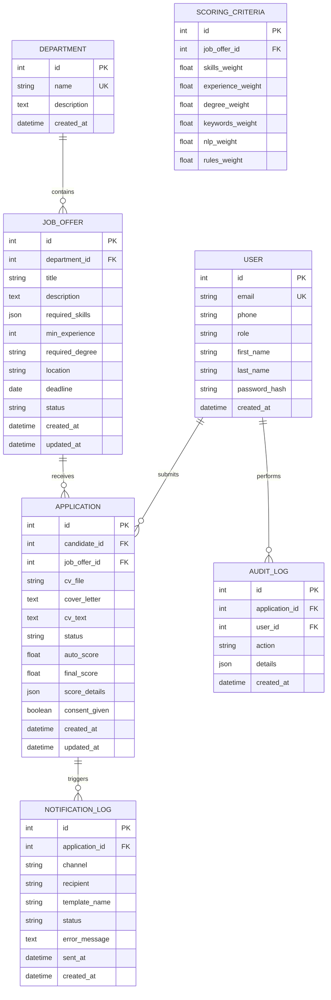

# Schéma entité-relation — SIGER

## Diagramme ER

## Tables PostgreSQL

### accounts_user
Extension du modèle User Django avec champs `phone`, `role` (candidat, recruteur, admin).

### jobs_department
Départements Maison Galaxy.

### jobs_joboffer
Offres d'emploi avec compétences en JSON.

### applications_application
Candidatures avec scores et détails JSON.

### scoring_scoringcriteria
Poids configurables par offre (défaut : skills 40 %, experience 25 %, degree 15 %, keywords 20 % ; rules 60 % / nlp 40 %).

### notifications_notificationlog
Historique des envois e-mail et SMS.

### applications_auditlog
Traçabilité des actions RH.

## Index recommandés

- `applications_application(job_offer_id, auto_score DESC)`
- `applications_application(candidate_id, status)`
- `jobs_joboffer(status, deadline)`
- `notifications_notificationlog(application_id, created_at)`
